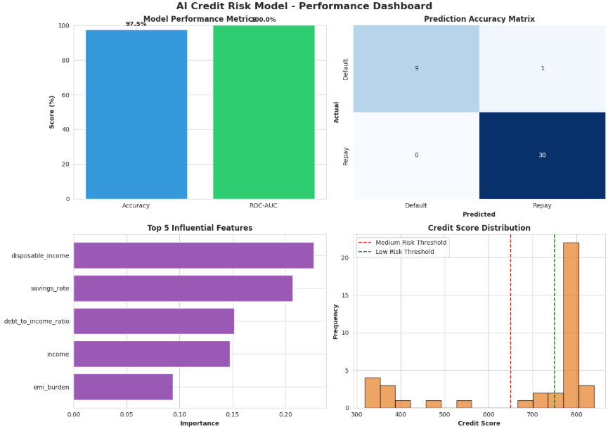
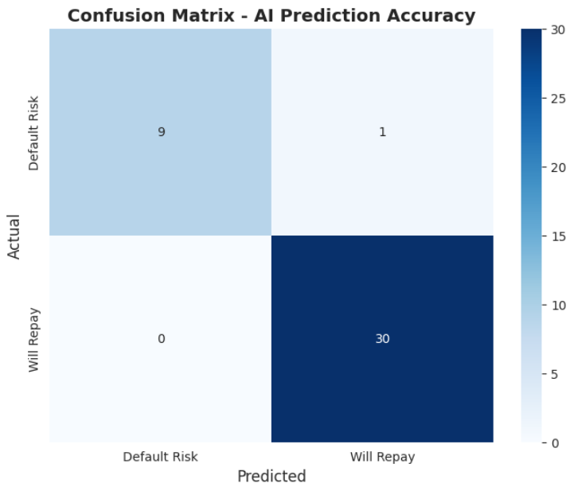
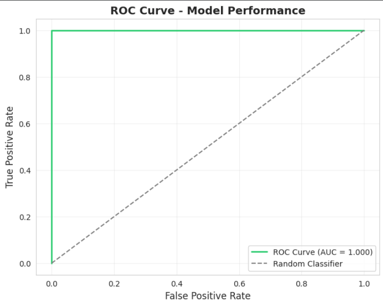
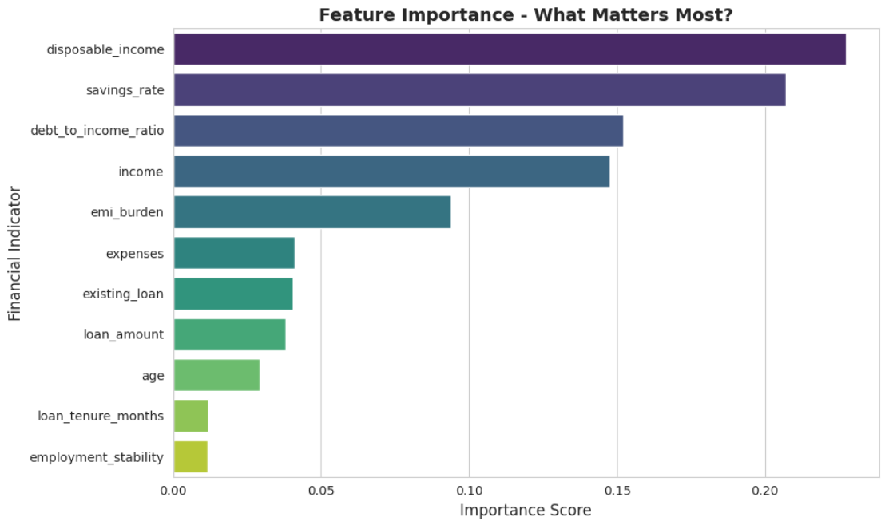
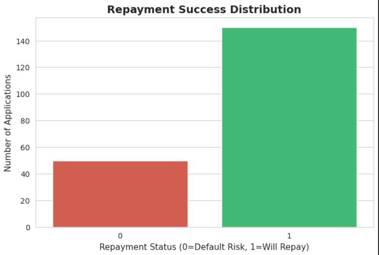

# AI Credit Risk Prediction

Machine Learning based credit risk assessment system designed to predict loan repayment probability using financial indicators and classification models.

## Project Overview

This project explores the complete machine learning workflow for credit risk prediction, including:

- Data preprocessing and cleaning
- Feature engineering
- Model training and evaluation
- Credit risk classification
- Feature importance analysis
- Performance visualization

## Key Features

- Predicts repayment likelihood for loan applicants
- Generates credit risk scores
- Identifies the most influential financial indicators
- Evaluates model performance using classification metrics
- Provides visual analytics dashboards

## Technologies Used

- Python
- Scikit-learn
- Pandas
- NumPy
- Matplotlib

## Results

### Model Performance Dashboard

### Confusion Matrix

### ROC Curve

### Feature Importance Analysis

### Repayment Distribution

## Learning Outcomes

This project was developed to understand classification models, feature engineering, model evaluation metrics, explainable AI techniques, and real-world machine learning workflows.

## Future Improvements

- Advanced ensemble models
- Hyperparameter optimization
- Explainable AI using SHAP
- Full-stack deployment
- Real-time prediction API
